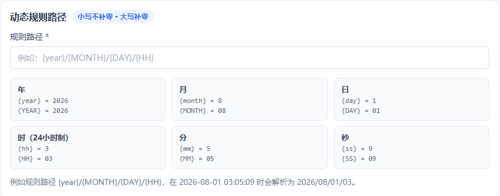
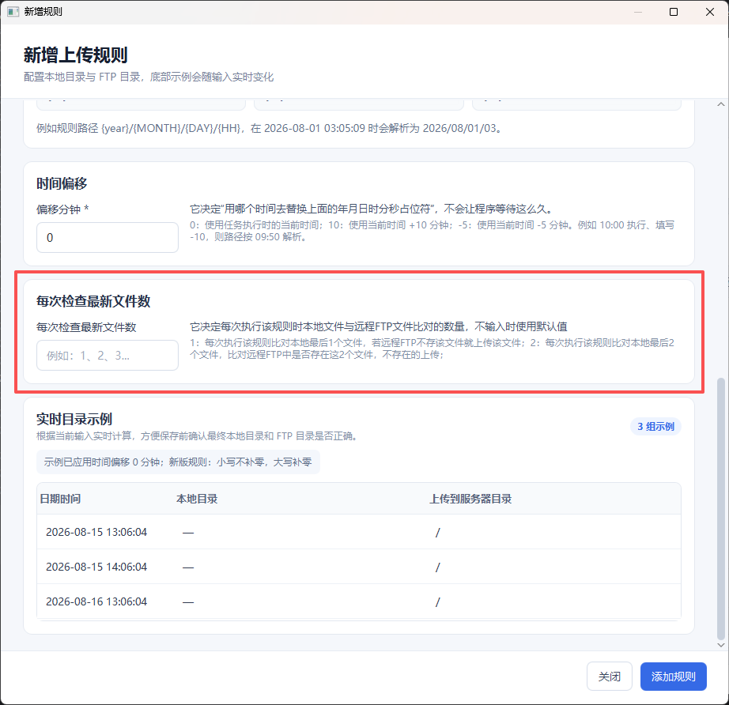
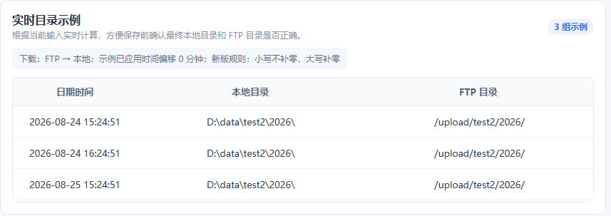
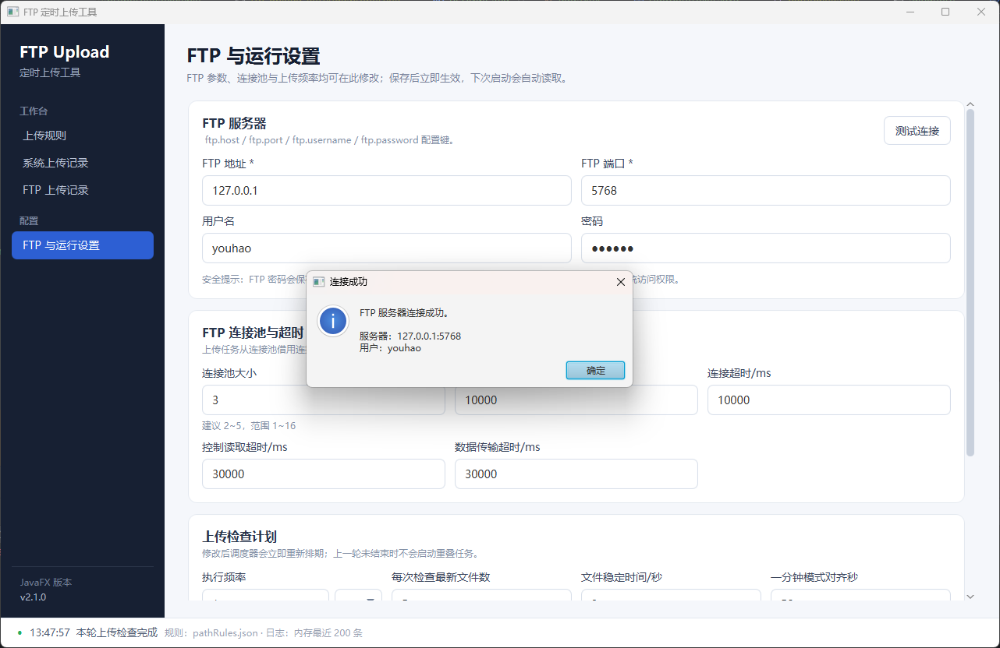

# FTP Upload 定时上传工具

一个基于 **JavaFX** 的桌面 FTP 定时上传工具。用于按照时间规则扫描本地目录，将 FTP 远端不存在的文件自动上传到对应目录。

适合气象数据、图片、报文、设备文件等需要按 **年 / 月 / 日 / 时 / 分 / 秒** 目录定时上传的场景。

---

## 1. 主要功能

- 多条上传规则管理：新增、查看、编辑、删除
- 支持按年、月、日、时、分、秒动态生成目录
- 支持时间偏移，例如读取当前时间前 5 分钟对应的目录
- 自动检查 FTP 远端文件，已存在的文件不会重复上传
- 上传频率可配置，支持秒、分钟、小时
- FTP 参数直接在界面中配置并持久化
- FTP 连接池，减少频繁创建连接的开销
- FTP 连接测试
- 系统运行记录，内存保留最近 200 条
- FTP 上传记录，内存保留最近 200 条
- FTP 连接、读取、数据传输均支持超时控制

---

## 2. 运行环境

| 环境 | 要求 |
|---|---|
| Java | JDK / JRE 21 |
| 构建工具 | Maven 3.9+ |
| 操作系统 | Windows 10 / 11；其他系统可自行构建测试 |
| 网络 | 可以访问目标 FTP 服务器 |

> JavaFX 包含平台相关组件。自行打包时，建议直接在最终运行的操作系统上执行 Maven 打包。

---

## 3. 安装方式

### 3.1 使用 Release 中的 JAR

如果 GitHub Releases 中已经提供打包好的 JAR：

1. 安装 Java 21。
2. 下载 `ftp-upload-javafx.jar`。
3. 在 JAR 所在目录打开终端。
4. 执行：

```bash
java -jar ftp-upload-javafx.jar
```

程序第一次运行后，会在工作目录保存运行配置和上传规则。

### 3.2 从源码运行

```bash
git clone <你的 GitHub 仓库地址>
cd ftp-upload-javafx
mvn clean javafx:run
```

### 3.3 从源码打包

```bash
mvn clean package
```

打包完成后使用：

```text
target/ftp-upload-javafx.jar
```

运行：

```bash
java -jar target/ftp-upload-javafx.jar
```

> `target/original-ftp-upload-javafx.jar` 是 Maven Shade 处理前的原始 JAR，不建议直接运行。

---

## 4. 快速开始

第一次使用只需要完成以下步骤：

1. 打开 **FTP 与运行设置**。
2. 填写 FTP 地址、端口、用户名和密码。
3. 点击 **测试连接**。
4. 测试成功后点击 **保存设置**。
5. 打开 **上传规则** → **新增规则**。
6. 配置本地目录、远程目录和动态规则路径。
7. 保存规则。
8. 点击 **立即执行** 测试一次，确认无误后即可让程序按设定频率自动运行。

---

## 5. 上传规则页面

> **📷 图 1：上传规则主界面**


上传规则页面用于管理所有自动上传任务。

顶部可以看到：

- 当前规则数量
- 当前执行频率
- 最近完成时间
- FTP 连接池状态
- 当前任务是否正在运行

规则支持：
- **启停规则**：查看规则和启停规则
- **查看**：查看完整配置
- **编辑**：修改规则
- **删除**：删除当前规则
- **双击规则**：快速进入编辑页面
- **立即执行**：不等待下一次定时任务，马上检查一次

---

## 6. 新增 / 编辑上传规则

> **📷 图 2：新增上传规则页面**


### 6.1 每个输入框的作用

| 配置项 | 必填 | 作用 | 示例 |
|---|---:|---|---|
| 规则名称 | 是 | 用于区分不同上传规则，只影响界面显示 | `雷达组合反射率` |
| 文件名称 / 说明 | 否 | 用于填写文件类型或备注；当前上传逻辑不使用它筛选文件 | `PNG` |
| 本地根目录 | 是 | 本地数据所在的固定根目录 | `D:\data\radar` |
| 远程根目录 | 是 | FTP 服务器保存文件的固定根目录 | `/upload/radar` |
| 规则路径 | 是 | 根据时间动态生成的子目录，本地和 FTP 远端都会使用 | `{YEAR}/{MONTH}/{DAY}/{HH}` |
| 时间偏移 / 分钟 | 是 | 改变“计算规则路径时使用的时间”，不是等待多久再上传 | `-5` |

实际扫描目录：

```text
本地根目录 + 规则路径
```

实际上传目录：

```text
远程根目录 + 规则路径
```

例如：

```text
本地根目录：D:\data\radar
远程根目录：/upload/radar
规则路径：{YEAR}/{MONTH}/{DAY}/{HH}
```

假设当前用于计算路径的时间是：

```text
2026-08-13 11:20:00
```

最终得到：

```text
本地目录：D:\data\radar\2026\08\13\11
FTP目录： /upload/radar/2026/08/13/11
```

---

## 7. 时间占位符

> **📷 图 3：时间占位符说明**



| 占位符 | 含义 | 示例 |
|---|---|---|
| `{year}` | 年 | `2026` |
| `{YEAR}` | 年 | `2026` |
| `{month}` | 月，不补 0 | `8` |
| `{MONTH}` | 月，补 0 | `08` |
| `{day}` | 日，不补 0 | `1` |
| `{DAY}` | 日，补 0 | `01` |
| `{hh}` | 时，不补 0 | `3` |
| `{HH}` | 时，补 0 | `03` |
| `{mm}` | 分，不补 0 | `5` |
| `{MM}` | 分，补 0 | `05` |
| `{ss}` | 秒，不补 0 | `9` |
| `{SS}` | 秒，补 0 | `09` |

简单记忆：

```text
小写：不补 0
大写：不足两位时补 0
```

例如：

```text
{YEAR}/{MONTH}/{DAY}/{HH}/{MM}
```

在 `2026-08-01 03:05` 时得到：

```text
2026/08/01/03/05
```

而：

```text
{year}/{month}/{day}/{hh}/{mm}
```

得到：

```text
2026/8/1/3/5
```
---

## 8. 每次检查最新文件数
> **📷 图 3：每次检查最新文件数**



每次执行规则时检查本地最新的几个文件在远程FTP服务器中是否存在，无则进行上传。

---

## 9. 时间偏移

时间偏移的单位是 **分钟**，表示生成规则路径时，在当前时间基础上增加或减少多少分钟。

它**不是“等待多少分钟后上传”**。

| 输入值 | 含义 |
|---:|---|
| `0` | 使用当前时间 |
| `10` | 使用当前时间 + 10 分钟 |
| `-5` | 使用当前时间 - 5 分钟 |
| `-60` | 使用当前时间 - 1 小时 |
| `-1440` | 使用当前时间 - 1 天 |

例如当前时间：

```text
2026-08-13 11:20
```

规则：

```text
{YEAR}/{MONTH}/{DAY}/{HH}/{MM}
```

时间偏移：

```text
-5
```

实际用于生成目录的时间为 `2026-08-13 11:15`，最终目录：

```text
2026/08/13/11/15
```

这个功能适合数据文件通常比当前时间晚几分钟生成的场景。

---

## 10. 实时目录示例

> **📷 图 4：规则实时示例**
> 


新增和编辑规则时，页面会根据当前输入实时计算示例。

保存规则前重点确认：

1. 本地目录是否与真实文件目录一致。
2. FTP 目录是否符合服务器目录结构。
3. 大小写占位符是否使用正确。
4. 时间偏移是否符合数据实际生成时间。

---

## 11. 软件如何判断需要上传哪些文件

每次任务执行时，一条规则按以下流程处理：

```text
计算规则时间
      ↓
替换时间占位符
      ↓
得到本地目录
      ↓
读取目录中的最新 N 个文件
      ↓
查询 FTP 对应目录
      ↓
比较文件名
      ↓
远端不存在 → 上传
远端已存在 → 跳过
```

程序不会每次扫描后把全部文件重新上传。

默认会检查本地目录中按文件名排序后的最新若干文件，具体数量可以在 **FTP 与运行设置** 页面修改。

> “文件名称 / 说明”字段用于备注和说明，不作为文件匹配条件。

---

## 12. FTP 与运行设置

> **📷 图 5：FTP 与运行设置页面**
> 


### 11.1 FTP 设置

| 配置项 | 作用 | 常用值 |
|---|---|---|
| FTP 地址 | FTP 服务器 IP 或域名 | `192.168.1.100` |
| FTP 端口 | FTP 服务端口 | `21` |
| 用户名 | FTP 登录用户名 | `ftpuser` |
| 密码 | FTP 登录密码 | `******` |
| 连接超时 | 建立 FTP 连接允许等待的最长时间 | `10000 ms` |
| 读取超时 | FTP 控制连接读取超时 | `30000 ms` |
| 数据超时 | 上传文件时数据连接超时 | `30000 ms` |
| 连接池大小 | 最多同时保留/使用的 FTP 连接数量 | `3` |
| 连接池等待超时 | 没有空闲连接时最多等待多久 | `10000 ms` |

填写完成后先点击 **测试连接**，成功后再点击 **保存设置**。

> **📷 图 6：FTP 连接测试成功弹窗**  



## 13. 上传频率设置

上传频率支持 **秒 / 分钟 / 小时**。

| 设置 | 效果 |
|---|---|
| `30 秒` | 每 30 秒检查一次 |
| `1 分钟` | 每分钟检查一次 |
| `5 分钟` | 每 5 分钟检查一次 |
| `1 小时` | 每小时检查一次 |

其他参数：

| 配置项 | 作用 |
|---|---|
| 一分钟对齐秒数 | 当按分钟执行时，用于指定每分钟的触发秒，例如 `58` 表示在每分钟第 58 秒触发 |
| 每次检查文件数 | 每个规则目录中最多检查多少个最新文件 |
| 文件稳定时间 | 文件最后修改后至少经过多少秒才允许上传，避免上传仍在写入的文件 |

修改完成后点击 **保存设置**，新配置会立即生效。

---

## 14. FTP 连接池

软件使用 FTP 连接池，不会为每一个文件都重新创建 FTP 连接。

```text
上传任务
   ↓
从连接池借出 FTP 连接
   ↓
检查连接是否可用
   ↓
执行目录查询 / 文件上传
   ↓
归还连接池
```

主要作用：

- 减少频繁登录 FTP 的耗时
- 降低 FTP 服务器连接压力
- 提高多规则运行时效率
- 异常连接不会继续放回连接池使用
- FTP 配置修改后旧连接自动失效

顶部的：

```text
FTP 连接 / 池大小
3 / 3
```

用于显示当前连接池状态。

---

## 15. 系统上传记录

> **📷 图 7：系统上传记录页面**
> 


系统记录主要包括：

- 定时任务开始和结束
- 规则执行情况
- 本地目录不存在
- FTP 连接异常
- 配置修改
- 其他运行错误

| 级别 | 含义 |
|---|---|
| `INFO` | 正常运行信息 |
| `WARN` | 警告，但程序通常仍可继续运行 |
| `ERROR` | 执行失败或异常 |

系统记录仅保留在内存中，最多 **200 条**，关闭程序后不会继续保存这些记录。

---

## 16. FTP 上传记录

> **📷 图 8：FTP 上传记录页面**


FTP 上传记录通常包含：

- 时间
- 规则名称
- 文件名称
- 状态
- 文件大小
- 上传耗时
- FTP 目录
- 处理信息

| 状态 | 含义 |
|---|---|
| 成功 | 文件已成功上传 |
| 跳过 / 已存在 | FTP 中已经存在该文件，不重复上传 |
| 失败 | 上传过程中发生异常 |

FTP 记录同样只在内存保留最近 **200 条**。

---

## 17. 配置文件

程序运行目录主要使用两个配置文件。

### `pathRules.json`

保存所有上传规则。

### `ftp-upload-settings.properties`

保存：

- FTP 地址、端口、用户名、密码
- FTP 超时时间
- 连接池大小
- 上传频率
- 文件检查数量
- 文件稳定时间等

一般情况下建议通过软件界面修改配置，不要直接编辑配置文件。

---

## 18. 完整规则示例

本地真实目录：

```text
D:\data\radar\2026\08\13\11
```

希望上传到：

```text
/upload/radar/2026/08/13/11
```

可以配置：

| 配置 | 值 |
|---|---|
| 规则名称 | `雷达数据` |
| 本地根目录 | `D:\data\radar` |
| 远程根目录 | `/upload/radar` |
| 规则路径 | `{YEAR}/{MONTH}/{DAY}/{HH}` |
| 时间偏移 | `0` |

如果数据通常晚 5 分钟生成，可以设置：

```text
时间偏移 = -5
```

---

## 19. 常见问题

### FTP 测试连接失败

依次检查：

1. FTP 地址、端口是否正确。
2. 用户名和密码是否正确。
3. Windows 或服务器防火墙是否放行。
4. FTP 服务是否允许被动模式。
5. 当前电脑是否能够访问 FTP 服务器。

### 本地有文件但没有上传

检查：

1. 规则实时示例中的本地目录是否正确。
2. 时间偏移是否正确。
3. 文件是否仍在写入。
4. FTP 中是否已经存在同名文件。
5. “每次检查文件数”是否太小。
6. 查看系统上传记录和 FTP 上传记录。

### 为什么 FTP 中已经存在的文件不上传？

这是正常行为。程序会先读取 FTP 目标目录文件名，同名文件已经存在时会跳过，避免重复上传。

### 为什么规则生成的目录不正确？

重点检查占位符大小写：

```text
{day}   → 1
{DAY}   → 01
{month} → 8
{MONTH} → 08
```

### 时间偏移为什么设置 `-5`？

`-5` 不是“5 分钟后上传”，而是使用 **当前时间 - 5 分钟** 来生成动态规则目录。

---

## 20. 使用建议

- 第一次新增规则后，先使用 **立即执行** 测试。
- 保存规则前检查页面上的实时目录示例。
- 上传频率不要明显高于文件产生频率。
- 大文件可以适当提高数据超时时间。
- FTP 服务器连接数有限时，不要把连接池设置得过大。
- FTP 密码会保存在本地配置文件中，请保护好软件运行目录。

---

请注意隐藏 FTP 密码等敏感信息。
