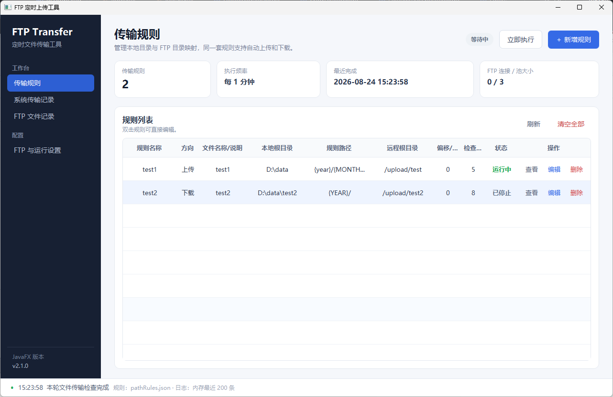
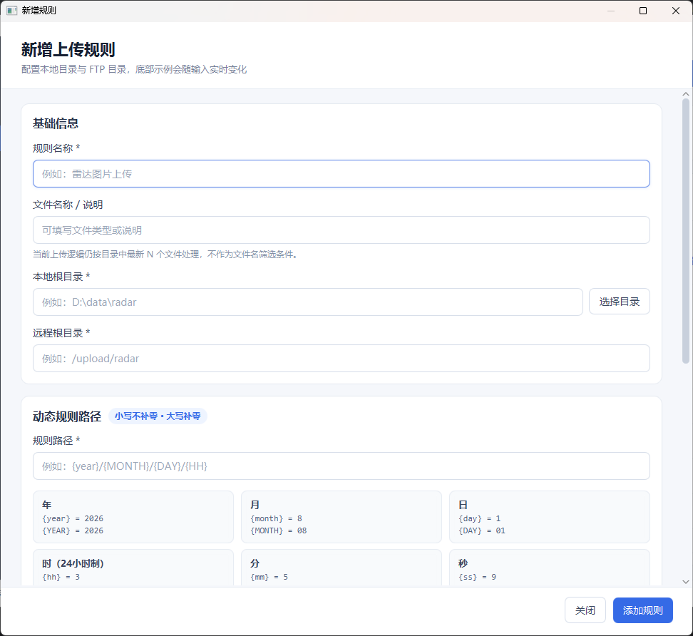
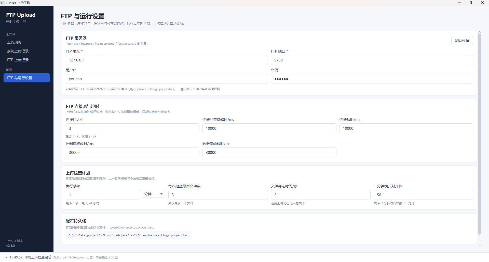
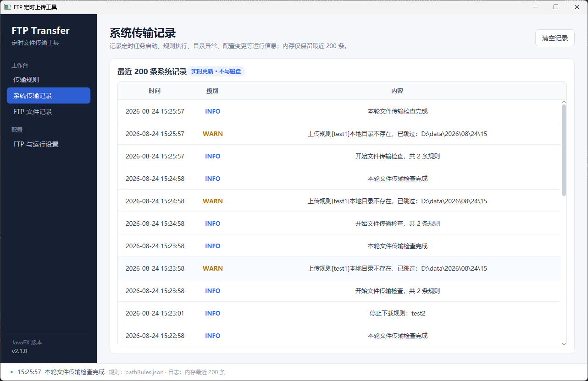
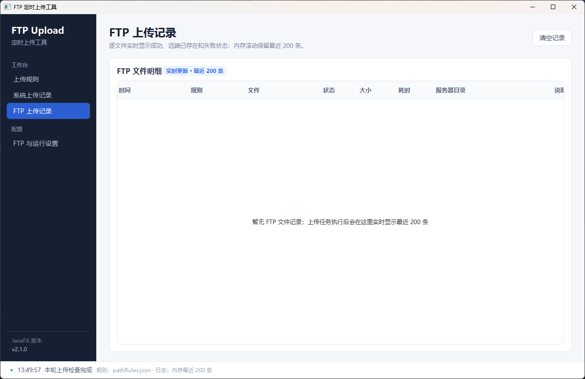

# FTP Synchronization

[中文](README.md) | [English](docs/README.en.md) | [日本語](docs/README.ja.md) | [한국어](docs/README.ko.md)

基于 JavaFX 的桌面 FTP 定时同步工具，可按照时间规则在本地目录与 FTP 目录之间自动上传或下载文件。

适合数据、图片、报文、设备文件等需要按 **年 / 月 / 日 / 时 / 分 / 秒** 目录定时同步的场景。

## 主要功能

- 管理多条上传、下载规则，可新增、查看、编辑、删除及启停。
- 按时间占位符动态生成本地和 FTP 目录，并支持分钟偏移。
- 仅同步目标端不存在的文件，避免重复上传或下载。
- 每条规则可配置检查最新文件数，也可使用全局默认值。
- 可配置执行周期、文件稳定时间、FTP 超时和连接池。
- 提供 FTP 连接测试、系统日志和逐文件传输日志。
- 支持跟随系统、中文、English、日本語和 한국어，切换后立即生效。
- GitHub Actions 自动生成 Windows、Linux、macOS 的 x64/ARM64 运行包。

## 下载和运行

从 GitHub Actions Artifacts 或 Releases 下载与系统匹配的文件：

| 系统 | x64 | ARM64 |
|---|---|---|
| Windows | `ftp-synchronization-<版本>-windows-x64.zip` | `ftp-synchronization-<版本>-windows-arm64.zip` |
| Linux | `ftp-synchronization-<版本>-linux-x64.tar.gz` | `ftp-synchronization-<版本>-linux-arm64.tar.gz` |
| macOS | `ftp-synchronization-<版本>-macos-x64.tar.gz` | `ftp-synchronization-<版本>-macos-arm64.tar.gz` |

发行包已经包含带 JavaFX 的 Java 21 JRE，用户不需要另外安装 Java。

解压后运行：Windows 双击 `run.bat`；Linux 执行 `./run.sh`；macOS 双击或执行 `run.command`。

```text
ftp-synchronization-<版本>-<系统>-<架构>/
├─ jre/                         # 带 JavaFX 的 Liberica Java 21 JRE
├─ ftp-synchronization.jar      # 应用及非 JavaFX 运行依赖
├─ run.bat / run.sh / run.command
├─ application.properties.example
├─ README.md
├─ docs/
└─ THIRD-PARTY-NOTICES.md
```

`ftp-synchronization.jar` 中不包含 `javafx/**`、`com/sun/javafx/**` 或 JavaFX 本地库；JavaFX 只存在于随包 `jre/` 中。

## 快速开始

1. 打开“FTP 与运行设置”。
2. 填写 FTP 地址、端口、用户名和密码。
3. 点击“测试连接”，成功后保存设置。
4. 打开“传输规则”，新增上传或下载规则。
5. 确认实时目录示例正确并保存。
6. 点击“立即执行”完成首次验证。

上传会读取本地最新 N 个稳定文件，远端不存在时上传；下载会读取 FTP 最新 N 个文件，本地不存在时下载。“文件名称 / 说明”仅用于备注。

## 规则配置

| 配置 | 说明 | 示例 |
|---|---|---|
| 规则名称 | 界面显示名称 | `雷达数据` |
| 传输方向 | 上传或下载 | `上传` |
| 本地根目录 | 本地固定目录 | `D:\data\radar` |
| 远程根目录 | FTP 固定目录 | `/upload/radar` |
| 规则路径 | 按时间生成的子目录 | `{YEAR}/{MONTH}/{DAY}/{HH}` |
| 时间偏移 | 计算目录时增加或减少的分钟数 | `-5` |
| 每次检查文件数 | 覆盖全局最新文件数 | `5` |

实际目录为“根目录 + 解析后的规则路径”。规则路径不能逃逸出本地根目录。

### 时间占位符

| 时间 | 未补零 | 补零 |
|---|---:|---:|
| 年 | `{year}` | `{YEAR}` |
| 月 | `{month}` | `{MONTH}` |
| 日 | `{day}` | `{DAY}` |
| 时 | `{hh}` | `{HH}` |
| 分 | `{mm}` | `{MM}` |
| 秒 | `{ss}` | `{SS}` |

在 `2026-08-01 03:05:09`，`{year}/{MONTH}/{DAY}/{HH}/{MM}/{SS}` 解析为 `2026/08/01/03/05/09`。旧规则继续保持原有忽略大小写补零行为。

## 语言设置

在“FTP 与运行设置”中可以选择跟随系统、中文、English、日本語或 한국어。首次启动默认跟随系统；中文、日文、韩文系统自动匹配，其它系统使用英文。选择后主界面立即重载，FTP 连接池和后台同步任务不会重启。

## 配置文件和升级兼容

- `pathRules.json`：保存全部同步规则，格式继续兼容旧版本。
- `ftp-synchronization-settings.properties`：保存 FTP、调度和语言设置。
- `application.properties` / `application.yml`：兼容工作目录外部配置。

如果新设置文件不存在而检测到 `ftp-upload-settings.properties`，程序会读取旧配置并生成新文件；旧文件不会删除。配置优先级为：内置默认值 → 工作目录配置 → 新界面设置文件。

## 从源码构建和测试

要求 Java 21。仓库包含 Maven Wrapper：

```powershell
.\mvnw.cmd clean verify
```

```bash
./mvnw clean verify
```

生成 `target/ftp-synchronization.jar`。开发环境可使用 `./mvnw javafx:run`。

`clean verify` 会执行配置迁移、四语资源、四语 FXML、规则 JSON、时间模板、监听器注销、ProGuard 和 JAR 边界测试。发现 JAR 中包含 JavaFX 内容时构建会失败。GitHub 流水线还会验证六个平台 JRE 的 JavaFX 模块并执行 GUI 冒烟测试。

流水线实现见 [GitHub Actions 打包说明](docs/GITHUB_ACTIONS_PACKAGING.zh-CN.md)；新增界面文案时请参考 [国际化维护说明](docs/I18N.zh-CN.md)。

## 界面示例











## 安全说明

- FTP 密码会以明文保存在本机设置文件中，请限制文件系统访问权限。
- 不要在截图、日志、提交记录或问题报告中公开 FTP 密码。
- 发布包附带 SHA-256 文件，下载后可校验完整性。
